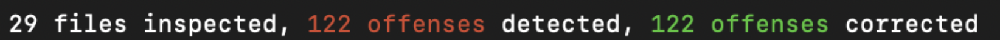

# [Rubocop](https://github.com/rubocop-hq/rubocop)

#### 1. Add the gems
Add the following gems to the `Gemfile`
```ruby
#...
group :development, :test do
  # ...
  gem "rubocop", require: false
  gem "rubocop-rspec"
  #...
end
#...
```

#### 2. Install the gems
```shell
$ bundle install
```

#### 3. Add base configuration file
Copy our base configuration from [here](https://gist.github.com/pernix-dev/bd87e002a3781bcc620aa77b014951ce) to a new file `.rubocop-pernix.yml`.

That will include all the rules that we think every project should conform to. If you think a rule should be added/modified/deleted please notify @captain_macho in Slack.

#### 4. Add project configuration file
Create a new file `.rubocop.yml` that has the following content
```yml
require: rubocop-rspec

inherit_from:
  - .rubocop-pernix.yml
```

#### 5. Check and Fix offenses
```shell
$ rubocop     # Check all the files
$ rubocop -a  # Check & Fix the files if possible can.
```

If a file is not automatically fixed, you will have to help rubocop by fixing it manually.

After the first run, you should see something like this:


