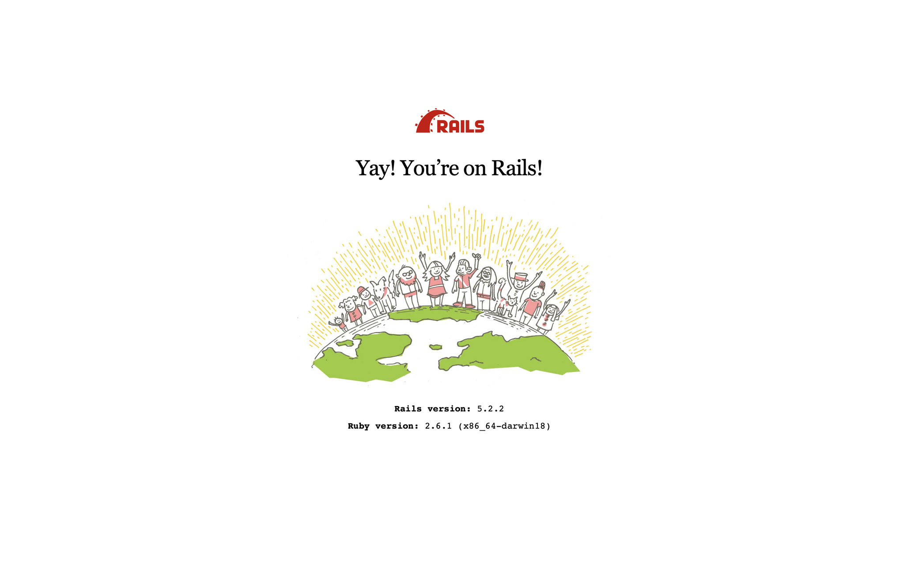

# Step 1. Installing dependencies

### RVM
We are going to use RVM as our Ruby Version Manager.\
Installation instructions can be found here: https://rvm.io/rvm/install


### Ruby
Install the latest Ruby version (2.6.1 at the time of writing this) using rvm
```shell
$ rvm install 2.6.1
```

Set the default Ruby version in your machine
```shell
$ rvm --default use 2.6.1
```

### Rails
Install the latest Rails gem version (5.2.2 at the time of writing this)
```shell
$ gem install rails
```


# Step 2. Creating a new Rails project
We are going to setup a new Rails project using Postgresql as our database.
```shell
$ rails new [project-name] -d postgresql -B  -T
```

`-B` Skips running `$ bundle`. This is to prevent gem installation before creating the `gemset`

`-T` Skips adding the default testing tools. We are going to be using RSpec. By default Rails uses MiniTest.


```shell
$ cd [project-name]
```

### Creating the Gemset
A Gemset is the folder in your machine where all the gems are going to be stored.

In order to do that, we need to do the following:
- Create a new file `.ruby-gemset` in the project's root folder.
- Add `[project-name]` to the file
- Execute: `$ cd .. && cd [project-name]`

### Ignoring some files
Add the following file names to the `.gitignore` file
- `.ruby-gemset`
- `/config/database.yml`

It is MANDATORY to ignore `database.yml`. It contains some personal information that you don't want to share with the world

In order to have a default database configuration we're going to create a template file. This file is a copy of the generated `database.yml` and it is the one that is going to be pushed to github. If you want to configure your database different, you can just change `database.yml` with personal information and it won't reflect in `git status` changes.

```shell
$ cp /config/database.yml /config/database.yml.template
```

### Project setup
```shell
$ bundle install    # This will install all dependencies
$ rails db:create   # This will create the database
$ rails db:migrate  # This will create the config/schema.rb file with the initial version
```

### Starting Rails server
```shell
$ rails s
```

Open the browser at http://localhost:3000 and you will see this:


